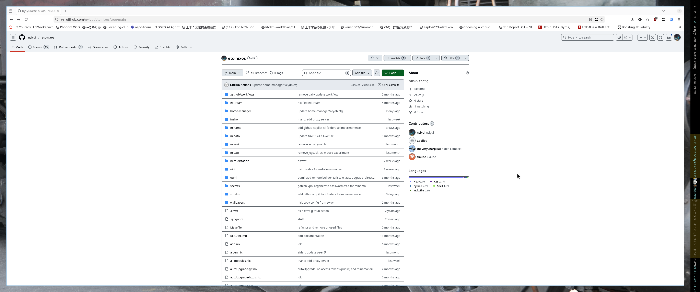

# NixOS configuration

## mitsu8 / living room TV PC

Main configuration file is `mitsu8/configuration.nix`, and
hardware configuration (e.g. disk partition UUIDs, architecture) is in `mitsu8/hardware-configuration.nix`.
Please add configuration to the main configuration file for most edits.

rclone - config contains access/refresh token, don't save here lol

Temporarily disable lid switch:
systemd-inhibit --what=handle-lid-switch sleep 10s
https://unix.stackexchange.com/a/285568

Delete generations (from /boot too):
nix-env -p /nix/var/nix/profiles/system --delete-generations +2
(see https://discourse.nixos.org/t/what-to-do-with-a-full-boot-partition/2049/3)

Blu-ray https://askubuntu.com/questions/1325752/missing-aacs-configuration-file-error-when-playing-blueray-movies
